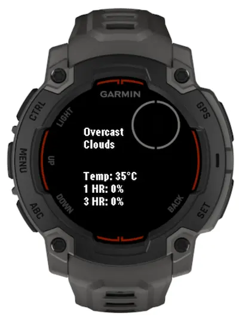
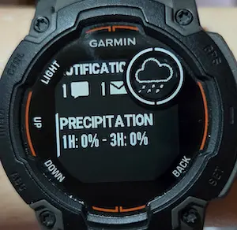

# garmin-weather

Because I'm too lazy to fire up a weather app on my phone.

Built-in garmin's weather apps requires too many clicks to get all the data I want, so here we are.

Api endpoint is from [this repo](https://github.com/kahnwong/weather-api).

## Pre-reqs

Specify config variables here: `./resources/properties.xml`.

```xml
<properties>
    <property id="apiEndpoint" type="string"></property>
    <property id="apiKey" type="string"></property>
</properties>
```

## Screenshots




